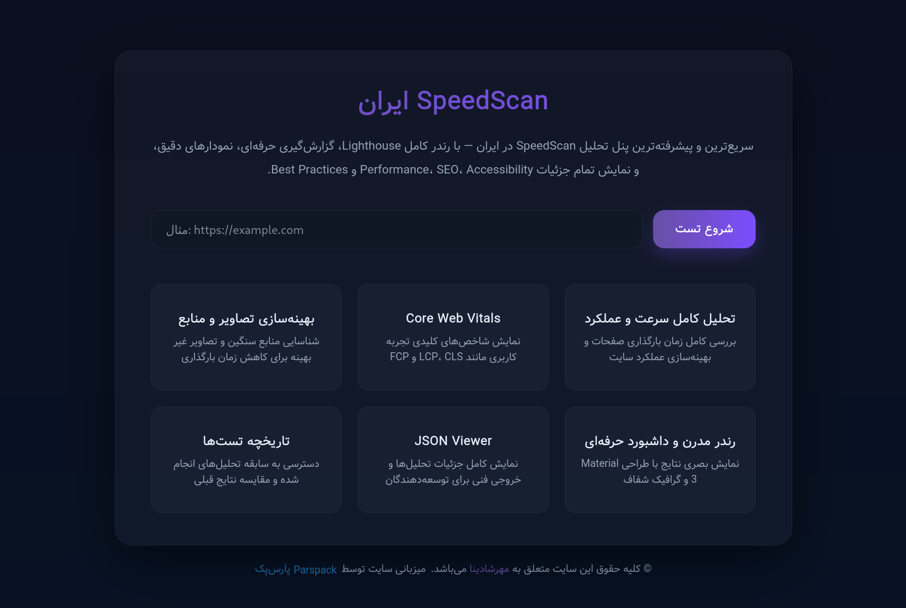

# SpeedScan.ir 🚀

**SpeedScan.ir** is a personal web performance testing platform designed to analyze website speed and performance based on **Google PageSpeed–related metrics**.

The website is publicly accessible, but the **source code and implementation are private and fully owned by the author**.

🌐 Live Website: https://speedscan.ir

---

## 🔐 Ownership & Usage Policy

This is a **personal project**.

### ✅ Allowed
- Public use of the **SpeedScan.ir website**
- Viewing this repository for **showcase and reference purposes**

### ❌ Not Allowed
- Copying or cloning the source code
- Running or deploying this project (fully or partially)
- Modifying, redistributing, or reselling any part of the code
- Using the code or logic in other projects

All rights to the codebase, architecture, and implementation are **strictly reserved** by the author.

---

## ✨ Features

- 📊 Website speed and performance analysis
- ⚡ Speed Index and Google PageSpeed parameters
- 🪶 Ultra-lightweight frontend implementation
- 🎯 Minimal HTTP requests
- 📱 Fast and responsive user experience

---

## 🛠 Technology Stack

### Backend
- **Django (Python)**

### Frontend
- **Pure HTML**
- **Pure CSS**
- **Vanilla JavaScript**

> No frontend frameworks or UI libraries are used in order to achieve the smallest possible site size and the lowest number of requests.

---

## 🎯 Project Purpose

This repository exists to:

- Showcase the project architecture and implementation
- Demonstrate performance-first web development principles
- Present the project as part of a personal portfolio

It is **not intended to be used as a reusable or open-source project**.

---

## 📄 License

**All Rights Reserved**

© 2025 SpeedScan.ir  
Unauthorized copying, modification, distribution, or use of this code is strictly prohibited.

---

## 👤 Author

**Mehrshadina**  
Website: https://mehrshadina.ir
GitHub: https://github.com/mehrshadina
